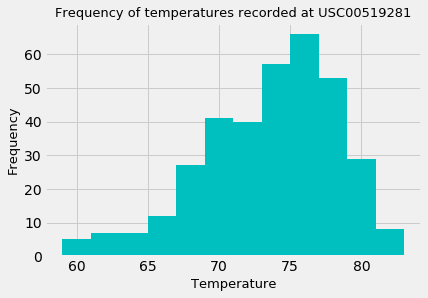

## sqlalchemy-challenge: Objectives

* Use Python and SQLAlchemy to query and analyze historic weather data of Hawaii
* Use pandas to visualize results
* Design a Flask API based on the queries

## Climate Analysis & Exploration

**Precipiration Analysis:**<br/>
A query was designed to retrieve precipiration data of the last 12 months in teh dataset. Precipitation recorded at each weather station across these dates are plotted in a bar chart.


**Station Analysis**<br/>
Another query was designed to look for the most-active weather station, i.e. the one with the highest number of observations. Temperatures recorded at that station in the last 12 months are plotted in a histogram to visualize the frequency of temperatures.



## Climate App##

Next, a Flask App with five routes is made to present ```jsonify``` results of the queries. User can also type in self-selected dates to run the queries.

## Additional Statistical Analyses##

**Correlation Analysis**<br/>
Average temperatures in June and December across all stations are calculated. As these two samples are considered independent, an indepedent t-test is performed to determine if the difference in the mean temperatures is statistically significant. Results suggest that such difference is indeed statistically significant.

**Y Error Analysis**<br/>
To research the temperature of Hawaii for a hypothetical trip with hypothetical dates, the minimum, average and maximum temperatures using the matching dates from the previous years are calculated. The average temperature and the y error bar (maximum temperature minus minimum temperature) are plotted to graphically show the variability of data and give an indication of the level of uncertainty.

As seen in the below chart, average temperature of Hawaii during the queried date range is around 70 degrees F. The length of the y error bar denoted by the black line is roughly one-third of that of the blue bar. The relatively smaller size of the y error bar suggests that the spread of data around the mean value is relatively low, and therefore the observed average temperature could be seen as somewhat reliable.


